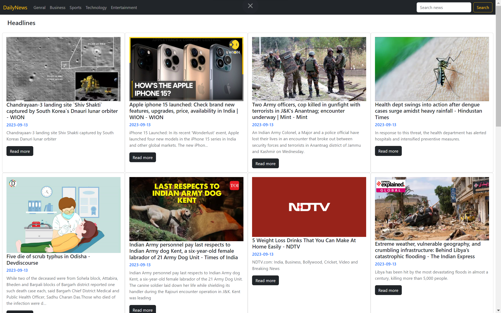

## News Portal
This repository contains a news portal project developed using HTML, CSS, and JavaScript, created as part of my internship at CodeClause

## Overview:
This project is part of the web development internship with CodeClause. The task involves creating a dynamic news portal that aggregates and displays news articles from a News API. The project aims to showcase your skills in front-end web development and your ability to work with external data sources to create an informative and user-friendly web application.



## Task Requirements
1. Front-End Development: Utilize HTML, CSS Bootstrap framework, and JavaScript to create the user interface and functionality of the news portal.

2. News API Integration: Incorporate a News API to fetch and display real-time news articles. You can use popular News APIs like NewsAPI or GNews API.

3. Responsive Design: Ensure that the news portal is fully responsive, providing an optimal user experience on various devices, including desktops, tablets, and smartphones.

4. Navigation: Implement a navigation menu that allows users to explore different news categories or sections.

5. Search Functionality: Include a search feature that allows users to search for specific news articles based on keywords.

6. Article Detail View: Design a detailed view for individual news articles, displaying the article's title, content, publication date, and source.

7. Error Handling: Implement error handling for cases where news articles cannot be retrieved from the API or if there are network issues.

8. UI/UX Design: Create an attractive and user-friendly design that makes it easy for users to browse and read news articles.

9. Documentation: Document your code and provide clear instructions on how to run the project locally.

## Project Structure
The project structure is organized as follows:

1. `index.html`: The main HTML file containing the structure and layout of the news portal.

2. `script.js`: JavaScript file for implementing the functionality of the news portal, including API integration and user interactions.

3. `Image/`: Directory to store any images or media used in the project.

4. `README.md`: This file, providing an overview and description of the project.


## Technologies Used
- HTML5: Used for structuring the registration form.
- CSS3 Bootstrap 5: Applied for styling and responsive design.
- JavaScript: Implemented client-side validation and error handling.
- (Optional) Backend Technology: If applicable, specify the technology used for handling form submissions.


## Usage
To view and interact with the news portal, simply open the index.html file in a web browser. Ensure an internet connection is available to fetch real-time news articles from the API.


## Getting Started

To get started with the Currency Converter web application, follow these steps:

1. Clone the repository to your local machine:

   ```bash
   git clone https://github.com/HariR1893/CodeClause_NewsPortal.git
   ```
2. Navigate to the project directory:
   `cd CodeClause_NewsPortal`

3. Start the development server:
    `npm run start`
   
5. The app will open in your default web browser at `http://localhost:3000.`

Feel free to explore and customize this project as you see fit. It's a great way to gain practical experience in web development during your internship at CODE CLAUSE!
